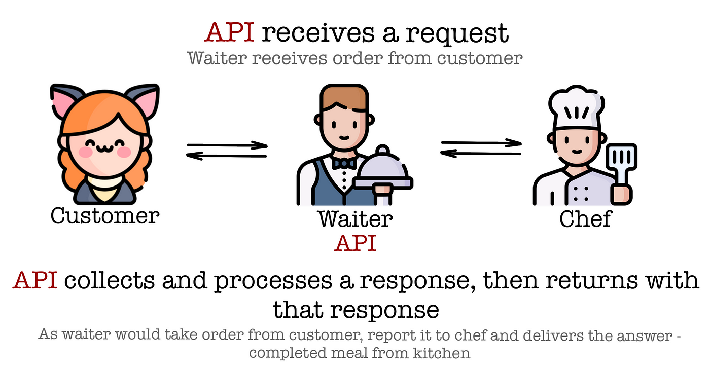

# Learn FastAPI

## 1 - What's an API
API stands for Application Programming Interface.
We use APIs to create a connection between two softwares, e.g: Server and Client.

**Real World Example:**



## 2 - Why FastAPI

- **Industry Standard**
- **Easy to use**
- **Provides automatic documentation**


# 3 - Installation

**We are using uv here but you can use pip as well !**

Open your IDE in a new empty folder, then follow these commands one by one in order.

```python
uv init # initializes a uv project

uv venv # creates a virtual environment

.venv\Scripts\activate #activates the virtual environment

uv add fastapi # installs fastapi package (ASGI Server)

uv add uvicorn # installs uvicorn packag

```

### What is uvicorn:
We need a server to run our apis, because apis run on server.
uvicorn executes apis on your local machine and considers it as a local server.

In real world we execute apis on a remote server

### What is ASGI Server

ASGI stands for Asynchronous Server Gateway Interface

Thousands of users use same API at the same time, so our API should be able to handle multiple requests asynchronously and ASGI allows us to do that.

## 4 - Basic FastAPI Setup

```python
from fastapi import FastAPI # import FastAPI class.
import uvicorn # import uvicorn for cerver

# I will show you two basic ways of creating an instance of FastAPI class.

# 1 Very basic, no need of any parameters.
app = FastAPI()

# 2 A better way, this will help us in documentation.
app = FastAPI(
    title="My First API",
    description="A simple API using FastAPI",
    version="0.116.0"
)


# a basic route for root directory (home page)
# we are sending a get request to / path (home page / root)
@app.get("/")
def read_root():
    return {"message":"Hello from FatAPI "}


# run uvicorn server
if __name__ == "__main__":

    # app will take the name of your file as value, like: "filename:app".
    # reload=True means we won't have to restart server on every change it will be automatically restarted. 
    uvicorn.run(app="main:app", reload=True) 
```

### More routes:

I've craeted one dynamic route here for demonstration.
You should create more outes for practice.

```python
# Send a get request to a dynamic route, user input (name) will be put in URL.
@app.get("/hello/{name}")
def read_user(name:str) -> dict:
    return {"message": f"Hello {name}"}

```

## 5 - Docs

Go to /docs to view documentation that FastAPI created for you automatically.